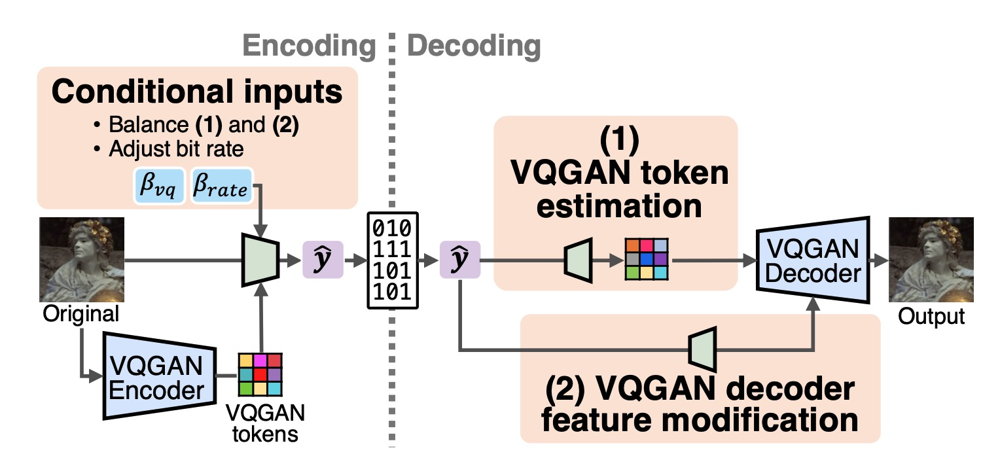
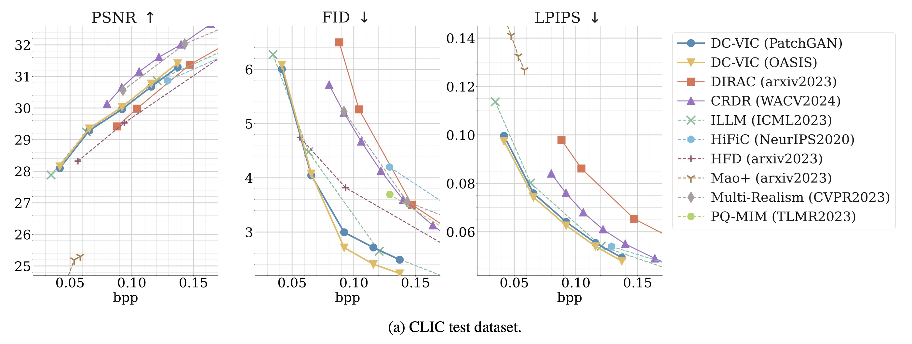

# Dual-Conditioned Training to Exploit Pre-trained Codebook-based Generative Model in Image Compression

Published in IEEE Access. [[Paper]](https://ieeexplore.ieee.org/abstract/document/10815956)

Authors: [Shoma Iwai](https://iwa-shi.github.io/), [Tomo Miyazaki](https://tomomiyazaki.github.io/), and [Shinichiro Omachi](http://www.iic.ecei.tohoku.ac.jp/~machi/index-e.html)


We propose a novel GAN-based learned image compression (LIC) method called **_DC-VIC_** (Dual-Conditioned VQGAN-based Image Compression). Our method leverages the full potential of a pre-trained VQGAN by incorporating two conditional inputs.




## Installation

#### 1. Clone this repository.

#### 2. Install [poetry](https://python-poetry.org/).
```
curl -sSL https://install.python-poetry.org | python3 -
```
We used `poetry==1.8.5`.

#### 3. Install dependencies using poetry.
```
poetry install
```

#### *Dependencies
```
PyTorch 1.12.1
CUDA 11.3
CompressAI 1.2.4
```
Other PyTorch/CUDA versions might work, but these are the environments that we tested.

## Quick Start

#### 1. Download the pre-trained models
You can download them from [GDrive](https://drive.google.com/drive/folders/1DWXd6NrZcBwZFGJ0bk8Bx1wZD9slzRTH?usp=sharing) manually or use the following command:
```
# Model trained with PatchGAN Discriminator
curl "https://drive.usercontent.google.com/download?id=1GmrJ-4IWsQTSZIMLHY6i3nD_VKg_A3-_&confirm=xxx" -o dc_vic_patchgan.pth.tar

# Model trained with OASIS Discriminator
curl "https://drive.usercontent.google.com/download?id=1PnG6K-ng0OpvEwoi8b0iD5qBwkS4hDXJ&confirm=xxx" -o dc_vic_oasis.pth.tar
```

#### 2. Run `compress.py`

You can run a quick test on the images in `./demo_images` (three images from [Kodak dataset](https://r0k.us/graphics/kodak/)) using the following command:
```
poetry run python scripts/compress.py --config_path ./config/dc_vic_patchgan.yaml --model_path ./checkpoint/dc_vic_patchgan.pth.tar --img_dir ./demo_images --save_dir ./demo_results/dc_vic_patchgan_q0 -q 0 --decompress -d cuda
```
The output will include:
- Binary compressed files (`kodimXXX.bin`)
- Reconstructed images (`kodimXXX.png`)
- Bitrate logs (`_bitrates.csv`, `_avg_bitrate.json`)

These files will be saved in `./demo_results/dc_vic_patchgan_q0.`

The average bitrate should be approximately `avg_bpp: 0.03921` (depending on your environment). Please check the reconstructed images to ensure they appear as expected.


> [!NOTE]
> Currently, only single-GPU is supported. If you are using a multi-GPU machine, you can specify `CUDA_VISIBLE_DEVICES={DEVICE_ID}` to avoid unexpected behavior.

## Reproduce Results in the Paper
#### 1. Make Reconstructions

You can run the pre-trained model on your dataset, such as the CLIC2020 test dataset and Kodak dataset.

```
poetry run python scripts/compress.py --config_path ./config/dc_vic_patchgan.yaml --model_path ./dc_vic_patchgan.pth.tar --img_dir PATH/TO/DATASET --save_dir ./results/dc_vic_qX_DATASET -q QUALITY --decompress -d cuda
```
- `--quality` adjusts the bitrate. Float value from `0` to `4` in our pre-trained model. `0`: Low bitrate, `4`: High bitrate

For example,
```
poetry run python scripts/compress.py --config_path ./config/dc_vic_patchgan.yaml --model_path ./dc_vic_patchgan.pth.tar --img_dir ./datasets/CLIC/test --save_dir ./results/dc_vic_patchgan_q0_CLIC -q 0 --decompress -d cuda
```

#### 2. Calculate Metrics

You can calculate metrics (PSNR, FID, LPIPS, DISTS) of the reconstructions by running the following script:
```
poetry run python scripts/calc_metrics.py --real_dir PATH/TO/DATASET --fake_dir PATH/TO/RECONSTRUCTIONS -d cuda
```
Results will be stored in `{fake_dir}/_metrics.json`.

For example,
```
poetry run python scripts/calc_metrics.py --real_dir ./datasets/CLIC/test --fake_dir ./results/dc_vic_patchgan_q0_CLIC -d cuda
```

You can find results on CLIC2020, Kodak, and DIV2K at [rd_results](./rd_results/).


# Training
See [training.md](./docs/training.md).


## TODO
- [x] Relase repository  
- [x] Add pre-trained models  
- [x] Add inference scripts  
- [x] Add RD-results  
- [x] Add training scripts  


## Acknowledgement
We thank the authors of the following repositories:
- [CompressAI](https://github.com/InterDigitalInc/CompressAI)
- [Taming Transformers (VQGAN)](https://github.com/CompVis/taming-transformers)
- [CodeFormer](https://github.com/sczhou/CodeFormer)
- [ELIC (unofficial implementation by JiangWeibeta)](https://github.com/JiangWeibeta/ELIC)
- [MMEngine](https://github.com/open-mmlab/mmengine/tree/main)

## Issues
If you have any questions or encounterd any issues, please feel free to open issue.