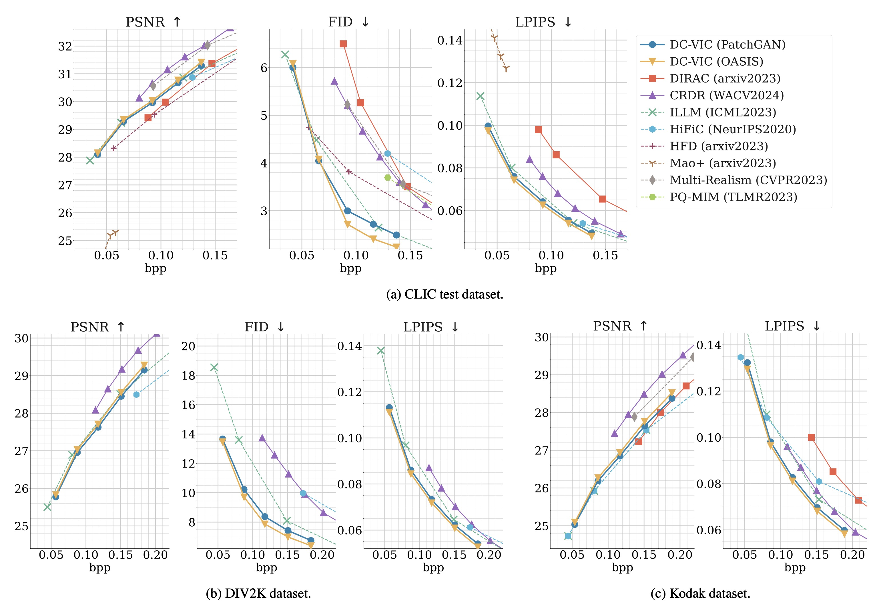

# Quantitative Results

Qualitative results presented in Figure 9 in our paper.

### Datasets:
- [CLIC 2020 test dataset](https://www.tensorflow.org/datasets/catalog/clic) (428 images)
- [DIV2K HR Validation dataset](https://data.vision.ee.ethz.ch/cvl/DIV2K/) (100 images)
- [Kodak dataset](https://r0k.us/graphics/kodak/) (24 images)

### Metrics:
- bpp (bits per pixel)
- PSNR
- FID (Followed protocol used in HiFiC [Mentzer+, NeurIPS2020])
- LPIPS
- DISTS